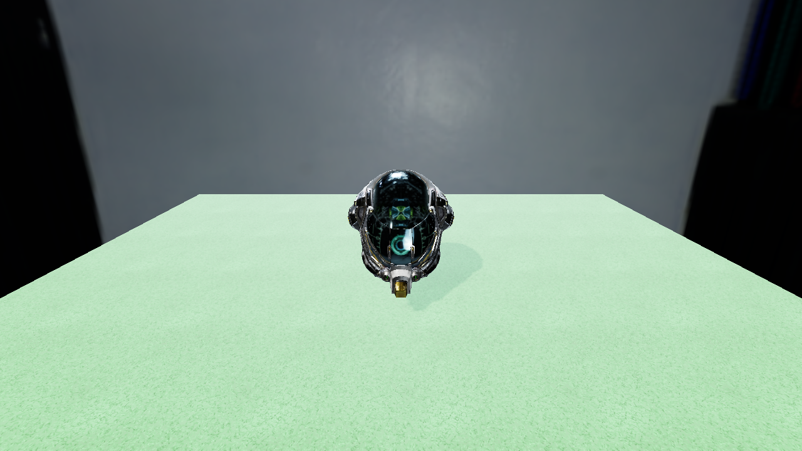

# Vérification visuelle — P3-M1 (instancing + culling d'ombre + fit d'ombre snappé)

**Date** : 2026-07-14 (session 14) · **Machine** : Windows 11, RTX 5070 Ti (Vulkan 1.3 core)
**Commits** : `ef1f713` · `0351cdd` · `bf4b392` (+ sol/herbe, non committé) · **Verdict humain** : _en attente_

## Ce que cette vérif doit prouver — et le prérequis qui manquait

Deux changements de P3-M1 ne peuvent être jugés que par un humain :

1. **Le rendu n'est plus bit-identique** à la Phase 2. Le fit d'ombre quantifie désormais son rayon et snappe son
   centre sur la grille de texels (correctif du crawl) : les ombres se décalent d'une fraction de texel. C'est voulu,
   mais ça doit rester **invisible à l'œil**.
2. Le bug que ce snap corrige — le **crawl des bords d'ombre** — ne se voit que **en mouvement**, jamais sur une
   capture fixe.

**Prérequis qui manquait** : la scène du Sandbox n'avait **aucun sol**. Le casque flottait dans l'HDRI et le seul
receveur d'ombre était le modèle lui-même — donc la qualité d'ombre, le crawl et tout le chemin de shadow fit
étaient littéralement **inobservables**. Un **sol herbeux** a été ajouté (quad texturé par une herbe procédurale
générée au chargement, aucun nouveau shader ni pipeline : c'est un `ModelAsset` comme un autre). Au passage le
soleil est passé à une intensité qui **domine l'IBL du studio** et l'exposition à 0,5 — sans quoi l'ombre se noyait
dans l'ambiante.

`AGAPANTHE_GROUND=0` retire le sol (ce que veulent les captures de précision, comparées à des baselines
d'avant-sol).



Banc `grid:100x100` (10 000 entités + sol) : **4 draw calls** (2 scène + 2 ombre — casque et sol),
cull+collect ~1,9–2,2 ms (Release JIT comme NativeAOT), 0 alloc/frame, 0 leak, 0 message de validation.

## Commandes et contrôles

```powershell
dotnet run -c Release --project samples/Sandbox
```

**Clic** dans la fenêtre pour capturer la souris (Échap libère, puis quitte). Déplacement **WASD** — et depuis ce
jalon **ZQSD et les flèches** marchent aussi : GLFW rapporte les touches par **position physique US**, ce qui
piégeait les claviers AZERTY.

## Test 1 — Le bord de l'ombre en mouvement (le cœur du jalon)

Avance/recule et tourne **lentement** autour du casque, en fixant le **bord de l'ombre portée sur l'herbe**.

- ✅ **PASS** si le bord est **stable** : il ne scintille pas, ne rampe pas, ne bouillonne pas pendant un mouvement
  continu. Un saut net et discret de temps en temps est **normal** (c'est l'escalier du snap texel).
- ❌ **FAIL** si le contour grouille ou vibre en permanence dès que la caméra bouge.

## Test 2 — Qualité de l'ombre (non-régression)

Casque immobile, caméra proche du contact avec le sol.

- ✅ **PASS** si l'ombre est nette et bien ancrée : pénombre douce (PCF), pas de rayures (acné), pas de décollement
  du contact au sol (peter-panning).
- ❌ **FAIL** si elle est visiblement plus floue/pixelisée qu'attendu, ou zébrée.

## Test 3 — Instancing sur la grande grille (la dette perf de M4)

```powershell
$env:AGAPANTHE_SCENE="grid:100x100"; $env:AGAPANTHE_CULL_STATS="1"; dotnet run -c Release --project samples/Sandbox
```

> ⚠️ **En `-c Release`**, jamais en Debug : le run Debug + validation layers coûtait 74–92 ms/frame et ne mesurait
> rien d'utile.

- ✅ **PASS** si la grille est **fluide** (le grief de la vérif P2-M4), si les 10 000 casques sont tous présents et
  correctement placés (ça valide `firstInstance`), et si le log affiche `draws 2+2 (instanced)` avec
  `per-frame alloc 0 B`.
- ❌ **FAIL** si des casques manquent ou clignotent, si des **ombres apparaissent/disparaissent brutalement** au bord
  de l'écran (popping = faux négatif du culling), ou si ça rame encore.

## Test 4 — Soleil au zénith (le bug MAJEUR corrigé)

Le wedge de culling ne cullait plus rien quand la lumière était verticale (les 4 plans latéraux, exactement
parallèles au rayon, étaient jetés). Un test unitaire l'épingle désormais. Contrôle optionnel : passer `Direction` de
la lumière directionnelle à `(0, -1, 0)` dans `samples/Sandbox/Program.cs`, relancer le banc → le nombre de shadow
casters doit **chuter nettement** sous 10 000, et **aucune ombre ne doit disparaître** de la vue.

## Résultat

| Test | Verdict | Notes |
|---|---|---|
| 1 — bord d'ombre en mouvement (crawl) | _à remplir_ | |
| 2 — qualité d'ombre (non-régression) | _à remplir_ | |
| 3 — grille 100×100 instanciée | _à remplir_ | |
| 4 — soleil au zénith (optionnel) | _à remplir_ | |
